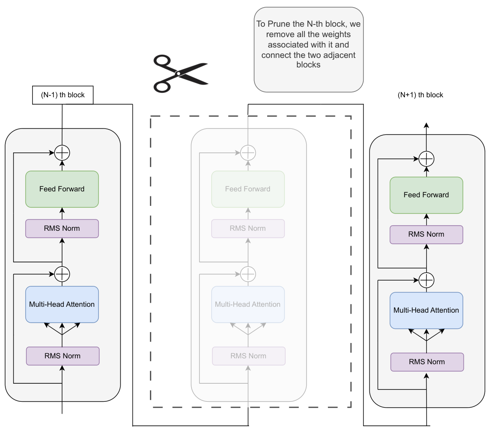

# Pruning LLAVA Model for Efficient Inference

## Features
- Prunes the LLAVA model based on a given unimportance order.
- Runs inference on pruned models to assess their performance.
- Iteratively prunes different sets of layers and saves responses.
- Saves inference results in a CSV file with the number of remaining layers and responses.

## Requirements
Ensure you have the following dependencies installed:

```bash
pip install torch transformers pillow requests
```
## Installation

## Usage
```bash
pip install -e .
```
### 1. Pruning and Inference
The script iteratively prunes the LLAVA model and performs inference on an image.

#### Example Code
```python
model_name = "Aranya31/Derm-LLaVA-1.5-7b-conv2"
model_id = "llava-hf/llava-1.5-7b-hf"
processor = AutoProcessor.from_pretrained(
'llava-hf/llava-1.5-7b-hf',
revision='a272c74'
)
unimportance_orders = [23, 4, 18, 22, 21, 24, 17, 27, 20, 26, 19, 29, 28, 5]
prompt = "What are the clinical features of rosacea?"
image_url = "./images/rosacea-70.jpg"
output_csv = "responses.csv"
iterative_pruning_and_inference(model_name, processor, unimportance_orders, prompt, image_url, output_csv)
```
#### With CLI
```bash
llava-prune --model-name "Aranya31/Derm-LLaVA-1.5-7b-conv2" \
           --prompt "What are the clinical features of rosacea?" \
           --image "./images/rosacea-70.jpg" \
           --output "responses.csv"
```
### 2. Saving Results
The script saves inference results in a CSV file (`results.csv`) with two columns:
- `num_of_layer`: The number of layers remaining after pruning.
- `response`: The model’s response to the prompt.

## Clearing GPU Memory
After each inference, the script removes the pruned model from the GPU and clears cache:
```python
del model_pruned
torch.cuda.empty_cache()
gc.collect()
```

## Contributions
Feel free to submit pull requests for improvements or additional features!

## License
This project is open-source under the MIT License.

